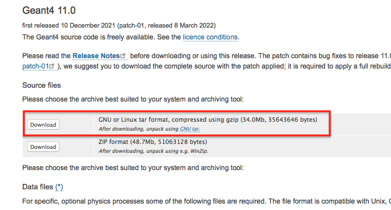

Preliminaries
--------------

Some of the most important elements of the technical environment will be review
very briefly in this section before moving to :guilabel:`Geant4`. This will include
a brief recap of the most relevant (C++) *object oriented(OO) concepts* such as **interface** or
a quick view on the :guilabel:`Geant4` *toolkit* **installation**. We will get familiar with the
**Virtual Machine(VM)** environment that will be used during the tutorial while we will understand
how the :ttt:`CMake` build system makes our life easier. These are all essential technical elements that
we will heavily rely on during this course.

Our most important object oriented concept: *interface*
.........................................................

:guilabel:`Geant4` provides the solution to particle transport simulation problems *independently form the details* by
*abstracting them away*. It has already been mentioned in the :ref:`Introduction <ref-Introduction>`, that this could be achieved by
carefully designed **interfaces** that a concrete application needs to implement. Since the simulation problem is actually defined by implementing
a set of :guilabel:`Geant4` interfaces, a clear understanding of how this object oriented concept works is essential for the rest of the course.

*Interface* is a very important object oriented concept that *captures some of the important commonalities* (behaviour, ability, etc.) of different type of
objects into a *common base*. This common base *doesn't know anything about the details* of the common behaviour in a particular type of object, just *serves as a blueprint for the different types*.
Then the different types take this blueprint and implement their own particular way of that common behaviour. Note, that it also ensures that all the different types that implements a common base/blueprint, for sure has that common behaviour or ability.

As a :ref:`simple example <ref-cpp-interface-doc>`, suppose that we are developing a solution algorithm that at a given point requires the sum area of all the 2D shapes that the user defines as part of the input (I know... but keep it simple.). So the sub-problem is the *area computation* of different 2D *shapes*.
We know that each 2D shape has an *area* (the commonality) but the way of its computation depends on the actual shape (different types).
So one might define a *common base for all* the 2D *shapes* that contains the *common ability* of providing the *area computation* ability without implementing anything. Then *the individual shape types* takes this common base and *implements their way of area computation*.
So eventually, the common functionality is **only defined in the base** but **implemented in the concrete types**. Therefore, our base serves as an *interface for* 2D *shape area computation*. Also note, that all the possible different shape types can implement our interface,
even those that we do not know. Therefore, using an interface decouples the solution from the details (i.e. the actual area computation) and the remaining part of algorithm can be completed without knowing all the details.

Different object oriented languages offer slightly different syntax for implemented such interfaces. In C++ the blueprint, that contains the definitions of the *common abilities as* **pure virtual method definitions**, is usually an **abstract base class**. The **concrete types** are derived then from this common base and implements the **pure virtual methods** of the base class. A method is declared to be **pure virtual** if it do not contain any implementation that achieved by the ``= 0;`` syntax. A class is called **abstract class** if it has at least one pure virtual method. Note, that it is **not possible to instantiate** objects from an **abstract class** simply because they have at least one unimplemented method (the pure virtual).

As an example, the following shows a possible implementation of the above 2D shape **area computation interface**. While the whole **abstract** :cpp:class:`VShape2D` **base class** is shown, please note the **pure virtual** :cpp:func:`VShape2D::Area()` method declaration. The complete working example is available under :file:`applications/preliminaries/cpp-interface`.

.. code-block:: cpp

    // This is called "include guard": used to avoid double inclusion that would
    // lead to double definition. Very good practice, check it and use.
    #ifndef VSHAPE2D_HH
    #define VSHAPE2D_HH

    #include <string>

    /**
     * @file   VShape2D.hh
     * @class  VShape2D
     * @author M. Novak
     * @date   May 2022
     *
     * **Interface**, i.e. base class with a **pure virtual** method, for 2D
     * shape area computations.
     *
     * This base class is an **interface** for 2D shape area computations. It has its
     * **pure virtual** Area() method. Therefore, this method **must be implemented
     * by each derived** classes. This ensures, that whatever type of an actuall 2D
     * shape is (derived from this base class) the Area() interface method will be
     * available. Therefore, the rest of the code can be developed without knowing
     * what 2D shapes will be eventually there: they will be all `VShape2D` types
     * providing their own implementation of the Area() interface method defined
     * in this base class.
     *
     * Note, that the **pure virtual** method makes this base class **abstract**,
     * i.e. objects cannot be instantiated directly form this base class.
     */

    // The `VShape2D` base class definition.
    class VShape2D {

    public:

      // constructor: requires the name of the shape
      VShape2D(const std::string& name) : fName(name) { }
      // destructor: no dynamic memory allocation so nothing to do
      virtual ~VShape2D() { }

      // public method to get the name: short so we implement here
      const std::string& GetName() const { return fName; }

      /**
       * The area computation *interface* method.
       *
       * Example of a **pure virtual** method that makes this base class **abstract**.
       *
       * Each 2D shape has an area but all computed differently depending on the
       * actual type of the shape. This is why it's a **pure virtual method**, i.e.
       * **each derived class must implement**.
       */
      virtual double Area() = 0;

      /**
       * *Optional* perimeter computation method.
       *
       * Example of a **virtual** method with defult implementation in the base class.
       *
       * Each 2D shape has its own way of computing the perimeter just like the area.
       * However, we decided that actually the perimeter is not important for our
       * algorithm in most cases of shapes. Therefore, this default implementation
       * is available for each derived class and will be invoked unless the concrete
       * derived class provides its own implementation. The derived `Square` class
       * implements this method while `Circle` relyes on this defult base class
       * implementation.
       */
      virtual double Perimeter() { return 0.0; }

    private:

     // name of the shape
     std::string  fName;

    };

    #endif // VSHAPE2D_HH

And a possible implementation of the **concrete** :cpp:class:`Square` **class** that **implements the** area computation **interface** for the concrete *square* shape type. Technically it means that the :cpp:class:`Square` class is **derived from** the :cpp:class:`VShape2D` **abstract base** and **implements its pure virtual interface method**.

.. code-block:: cpp

    #ifndef SQUARE_HH
    #define SQUARE_HH

    // inlcude the base class definition
    #include "VShape2D.hh"

    /**
     * @file   Square.hh
     * @class  Square
     * @author M. Novak
     * @date   May 2022
     *
     * @brief Derived class that implements the VShape2D interface for Square-s.
     */

    // square is a derived from the 2D shape base class
    class Square : public VShape2D {

    public:

      // constructor: requires the length of the side
      // - it calls the base class constructor by passing the required name
      Square(double lside) : VShape2D("mySquare"), fSideLength(lside) { }

      // no dynamic memeory allocation so nothing to do at destruction
      ~Square() { }

      /**
       * Actual implementation of the area computation interface method of the
       * base class.
       *
       * Square **must implement** the VShape2D::Area base class method since that's
       * a **pure virtual method**.
       *
       * @note The `override` keyword is very useful: indicates that this method
       *  implements a virtual method of the base class so the compiler is
       *  aware of that intention.
       */
      double Area() override { return fSideLength*fSideLength; }

      /** The **optional** `Perimeter` interface method implementation. */
      double Perimeter() override { return 4.0*fSideLength; }

    private:

      // the only data member is the length of the edge
      double  fSideLength;

    };

    #endif  // SQUARE_HH

Also note, that the :cpp:class:`VShape2D` base class has an other *virtual* method, the :cpp:func:`VShape2D::Perimeter()` that actually has an implementation in the base class so this method is **not pure virtual**. Since this method already has an implementation in the base class, the derived classes might optionally provide their own implementation of this method or not at all. The default implementation, i.e. the one in the base class will be used in the later case.

.. tip:: The above **dynamic** or **run-time polymorphism**, i.e. the run-time resolution of function calls, is achieved in C++ through the *combination of inheritance and virtual methods*.
    From the computing performance point of view, in some cases it might be beneficial to make this resolution at **compile time**. **Static** or **compile time** polymorphism can be achieved by the template metaprogramming based Curiously Recurring Template Pattern (CRTP) C++  construct.

Some useful unix commands
...........................

It might be useful to refresh some of the most important unix commands since we will work in the terminal. This can also be used during the course as a cheat sheet.

==========================   ====================
     Command                    Meaning / effect
==========================   ====================
    ``ls``                        list files in the current directly
    ``ls -l``                     same as above in long format (more details)
    ``.``                         the current working directory
    ``..``                        parent directory
    ``~``                         home directly
    ``cp`` `file1` `file2`        copy `file1` to `file2`
    ``mv`` `file1` `file2`        move/rename `file1` to `file2`
    ``rm`` `file`                 remove/delete `file`
    ``pwd``                       print working directory (Where am I?)ß
    ``cd`` `dirname`              change to `dirname` directory (e.g. change to your home directory ``cd ~``)
    ``mkdir`` `dirname`           make directory with the name `dirname`
    ``rmdir`` `dirname`           remove/delete directory with the name `dirname`
    ``rmdir -r`` `dirname`        removes even sub-directories recursively
    ``cat`` `file`                show the content of `file`
    ``more`` `file`               shows the file page by page
    ``ctrl + C``                  interrupts the running process
    ``echo`` `string`             write out the string (e.g. write out the value of a shell variable like PATH as ``echo $PATH``)
    ``$``                         use the ``$`` prefix front of shell variables to get their value (e.g. above)
==========================   ====================

.. _ref_BuildFromSRC:

:guilabel:`Geant4` installation
.................................

Building and installing :guilabel:`Geant4` from source will be shown very briefly in this section. This will be the standard way of using the :guilabel:`Geant4` toolkit when you become an experienced :guilabel:`Geant4` application developer (hopefully after this course).
Moreover, this will also help to understand better why we decided to use the common :ref:`Virtual Machine(VM) <ref-vm-doc>` version for this course.

While all the details regarding the installation of the :guilabel:`Geant4` toolkit can be found in the :g4userdoc:`UsersGuides/InstallationGuide/html/, Installation Guide`, we will focus here only :g4userdoc:`UsersGuides/InstallationGuide/html/installguide.html, building and installing from source on unix system`. Note, that certain softwares/libraries must be installed on your system in order to be able to build and/or use :guilabel:`Geant4`.
These are listed in the :g4userdoc:`UsersGuides/InstallationGuide/html/gettingstarted.html, System/Software Prerequisites` section of the :g4userdoc:`UsersGuides/InstallationGuide/html/, Installation Guide`.

Obtain the source
^^^^^^^^^^^^^^^^^^^^^

The first step is to obtain the source code of the :guilabel:`Geant4` toolkit that can be downloaded from :g4wpage:`support/download, Downloads` (see the screenshot in :numref:`fig_g4download_screenshot`).

.. _fig_g4download_screenshot:

   :guilabel:`Geant4` page screen shot for downloading the toolkit source code

It will be assumed in the following that the :guilabel:`Geant4` source code has been downloaded to the :file:`G4DOWNLOAD` directory. After moving to this directory we can see the following when we list the content with the ``ls`` command::

  bash-3.2$ ls
  geant4-v11.0.1.tar.gz

Then we can uncompress the source code by::

  bash-3.2$ tar -xzvf geant4-v11.0.1.tar.gz
  x geant4-v11.0.1/
  x geant4-v11.0.1/.github/
  x geant4-v11.0.1/.github/CODEOWNERS
  x geant4-v11.0.1/.gitignore
  x geant4-v11.0.1/CMakeLists.txt
  x geant4-v11.0.1/CONTRIBUTING.rst
  x geant4-v11.0.1/LICENSE
  x geant4-v11.0.1/README.rst
  x geant4-v11.0.1/ReleaseNotes/
  x geant4-v11.0.1/ReleaseNotes/Beta4.10.0-1.txt
  x geant4-v11.0.1/ReleaseNotes/Beta4.10.1-1.txt
  x geant4-v11.0.1/ReleaseNotes/Beta4.10.2-1.txt
  x geant4-v11.0.1/ReleaseNotes/Beta4.10.3-1.txt
  x geant4-v11.0.1/ReleaseNotes/Beta4.10.4-1.txt
  ...

that eventually will create a subdirectory in the :file:`G4DOWNLOAD` directory containing all the source codes::

  bash-3.2$ ls
  geant4-v11.0.1		geant4-v11.0.1.tar.gz

It will be assumed in the following that the created subdirectory, with all the uncompressed :guilabel:`Geant4` source code, is :file:`G4SRC`. This means :file:`G4SRC` = :file:`full/path/to/geant4-v11.0.1` in the above example (please note, that you need to replace ``/full/path/to`` with your actual path to the uncompressed source directory), that can be set as an environment variable as::

  bash-3.2$ export G4SRC=/full/path/to/geant4-v11.0.1

Then we can check if everything set properly by writing the value of the newly created environment variable as::

  bash-3.2$ echo $G4SRC
  /full/path/to/geant4-v11.0.1

and eventually move to the source code directory and list the content as::

  bash-3.2$ cd $G4SRC
  bash-3.2$ ls
  CMakeLists.txt		LICENSE			ReleaseNotes		config			examples
  CONTRIBUTING.rst	README.rst		cmake			environments		source

.. _ref_InstallFromSource:

Configure, build and install
^^^^^^^^^^^^^^^^^^^^^^^^^^^^^^^

We will create a :file:`build` subdirectory here that will be used then to store our build configuration and :ttt:`Makefiles` generated by using :ttt:`CMake` (see some reasons later :ref:`why we use it <ref-why-cmake>`). So we crate the :file:`build` subdirectory inside the :envvar:`G4SRC` and change to that::

  bash-3.2$ mkdir $G4SRC/build
  bash-3.2$ cd $G4SRC/build

Then we will use :ttt:`CMake` to configure the build and generate the corresponding unix :ttt:`Makefiles`. Note, that having the appropriate version of :ttt:`CMake` installed and available on your system is part of the :g4userdoc:`UsersGuides/InstallationGuide/html/gettingstarted.html, Prerequisites` for building and/or using :guilabel:`Geant4`.

There are several configuration options to set how :guilabel:`Geant4` is built, installed and what optional components of the toolkit are enabled. Some of them are
provided by :ttt:`CMake` itself while there are several :guilabel:`Geant4` specific configuration options. All of them are listed and described in the :g4userdoc:`UsersGuides/InstallationGuide/html/installguide.html#geant4-build-options, Build Option` section of the :g4userdoc:`UsersGuides/InstallationGuide/html/, Installation Guide`.

One very useful :ttt:`CMake` option is ``CMAKE_INSTALL_PREFIX``. This can be used to set the required installation location. Suppose that we want to install :guilabel:`Geant4` under a :file:`path/to/install/dir`, that actually we also set to be stored in a new environment variable :envvar:`G4INSTALL` (by ``export``-ing it similarly to :envvar:`G4SRC` above),
we can configure the build as ``-DCMAKE_INSTALL_PREFIX=$G4INSTALL``. An other, already :guilabel:`Geant4` specific :ttt:`CMake` configuration option, is ``GEANT4_INSTALL_DATA`` with the possible values of ``ON/OFF(default)``. Turning this ``ON`` results in downloading and installing all the datasets that :guilabel:`Geant4` requires. Please note, that all the
:guilabel:`Geant4` configuration and build options starts with the ``GEANT4_`` prefix. Beyond the `optional` configuration options mentioned so far, :ttt:`CMake` has a `required` input argument. This is the `top level` :file:`CMakeLists.txt` :ttt:`CMake` input file location, that is usually located in the main directory of the projects.
In our case, this is the parent directory of our current :file:`$G4SRC/build`. Therefore, configuring our current :guilabel:`Geant4` build from the :file:`$G4SRC/build` subdirectory, such that we require

  - to install the toolkit under :file:`$G4INSTALL` : ``-DCMAKE_INSTALL_PREFIX=$G4INSTALL``
  - downloading and installing all :guilabel:`Geant4` datasets: ``-DGEANT4_INSTALL_DATA=ON``

can be down as::

  bash-3.2$ cmake ../ -DCMAKE_INSTALL_PREFIX=$G4INSTALL -DGEANT4_INSTALL_DATA=ON
  -- The C compiler identification is GNU 10.2.0
  -- The CXX compiler identification is GNU 10.2.0
  -- Checking whether C compiler has -isysroot
  -- Checking whether C compiler has -isysroot - yes
  -- Checking whether C compiler supports OSX deployment target flag
  -- Checking whether C compiler supports OSX deployment target flag - yes
  -- Detecting C compiler ABI info
  -- Detecting C compiler ABI info - done

  ...

  -- Found Threads: TRUE
  -- The following Geant4 features are enabled:
  CMAKE_CXX_STANDARD: Compiling against C++ Standard '17'
  GEANT4_BUILD_MULTITHREADED: Build multithread enabled libraries
  GEANT4_BUILD_TLS_MODEL: Building with TLS model 'initial-exec'
  GEANT4_USE_SYSTEM_EXPAT: Using system EXPAT library

  -- Configuring done
  -- Generating done
  -- Build files have been written to: ...

.. tip::

   After the configuration, still inside the :file:`G4SRC/build` subdirectory, one can inspect/change the configuration options before the build by :envvar:`bash-3.2$ ccmake .` that will open the configuration settings and offers the possibility to e.g. change values.
   Try this out, especially its advanced mode using the ``t`` key to see the large number of configuration options that :guilabel:`Geant4` provides.

After the successful configuration (i.e. receiving no configuration errors above), one can easily build and install the :guilabel:`Geant4` toolkit now as (``-j6`` building parallel with 6 threads)::

    bash-3.2$ make -j6
    [  0%] Creating directories for 'G4INCL'
    [  0%] Creating directories for 'G4SAIDDATA'
    [  0%] Creating directories for 'G4ENSDFSTATE'
    [  1%] Creating directories for 'G4PII'
    [  1%] Creating directories for 'RealSurface'
    [  1%] Creating directories for 'G4ABLA'
    [  1%] Performing download step (download, verify and extract) for 'G4SAIDDATA'
    [  1%] Performing download step (download, verify and extract) for 'G4PII'
    [  1%] Performing download step (download, verify and extract) for 'G4ENSDFSTATE'
    [  1%] Performing download step (download, verify and extract) for 'G4ABLA'
    [  1%] Performing download step (download, verify and extract) for 'G4INCL'
    [  1%] Performing download step (download, verify and extract) for 'RealSurface'
    -- Downloading...

    ...

    [100%] Building CXX object source/CMakeFiles/G4physicslists.dir/physics_lists/util/src/G4HadProcesses.cc.o
    [100%] Building CXX object source/CMakeFiles/G4physicslists.dir/physics_lists/util/src/G4PhysListUtil.cc.o
    [100%] Building CXX object source/CMakeFiles/G4physicslists.dir/physics_lists/util/src/G4WarnPLStatus.cc.o
    [100%] Linking CXX shared library ../BuildProducts/lib/libG4physicslists.dylib
    [100%] Built target G4physicslists

then after the successful build, install the :guilabel:`Geant4` toolkit under the previously set :file:`$G4INSTALL` location as::

    bash-3.2$ make install
    [  0%] Built target G4ENSDFSTATE
    [  0%] Built target G4INCL
    [  0%] Built target G4ABLA
    [  1%] Built target G4SAIDDATA
    [  2%] Built target G4PII
    [  2%] Built target RealSurface
    [  2%] Built target G4NDL
    [  2%] Built target G4PARTICLEXS

    ...

    -- Installing: ...

This last step above only makes all the headers, configuration files, libraries that have been just built to the location specified during the configuration. Before starting to use the freshly installed :guilabel:`Geant4` toolkit on our system, one needs to
make sure that all the related environment settings are done (e.g. setting :envvar:`PATH`, :envvar:`*_LIBRARY_PATH` or other :guilabel:`Geant4` specific environment variables such as data set location, etc.). All the details are given in the :g4userdoc:`UsersGuides/InstallationGuide/html/postinstall.html, Postinstall Setup` of the :g4userdoc:`UsersGuides/InstallationGuide/html/, Installation Guide`.
This can be done by using the script provided after the installation under :file:`$G4INSTALL/bin` as::

    bash-3.2$ source $G4INSTALL/bin/geant4.sh
    bash-3.2$ echo $G4LEDATA
    /what/you/set/as/install/location/share/Geant4-11.0.1/data/G4EMLOW8.0

This above includes writing out one of the :guilabel:`Geant4` specific environment variable value just for cross checking that everything is set as we expect.

Try an example application
^^^^^^^^^^^^^^^^^^^^^^^^^^^^^^^

As an example, we can build and execute one of the :guilabel:`Geant4` example applications that are delivered by the toolkit. They can be found under the :file:`$G4SRC/examples`. We can try one of the `basic` examples like :file:`/basic/B1`. So first change the directory to this location and create a :file:`build` subdirectory there and entering::

    bash-3.2$ cd $G4SRC/examples
    bash-3.2$ ls
    CMakeLists.txt		README			advanced		novice
    GNUmakefile		README.HowToRun		basic
    History			README.HowToRunMT	extended
    bash-3.2$ cd basic/
    bash-3.2$ ls
    B1		B3		B5		GNUmakefile	README
    B2		B4		CMakeLists.txt	History
    bash-3.2$ cd B1
    bash-3.2$ ls
    CMakeLists.txt	History		exampleB1.cc	exampleB1.out	init_vis.mac	run2.mac	vis.mac
    GNUmakefile	README		exampleB1.in	include		run1.mac	src
    bash-3.2$ mkdir build
    bash-3.2$ cd build/

Then the build of the example can be configured by using :ttt:`CMake` as::

    bash-3.2$ cmake ../ -DGeant4_DIR=$G4INSTALL/lib/Geant4-11.0.1/
    -- The C compiler identification is GNU 10.2.0
    -- The CXX compiler identification is GNU 10.2.0
    -- Checking whether C compiler has -isysroot
    -- Checking whether C compiler has -isysroot - yes

    ...

    -- Generating done
    -- Build files have been written to: ...

Note, that as before, :ttt:`CMake` requires the location of the top level :file:`CMakeLists.txt` of the project and the location of the :guilabel:`Geant4` toolkit :ttt:`CMake` configuration file, that
has been installed under the :file:`$G4INSTALL/lib/Geant4-11.0.1/` location. This latter must be provided through the `Geant4_DIR` :ttt:`CMake` configuration option as shown above. One can export this location into an environmental variable (e.g. :envvar:`export G4COMP=$G4INSTALL/lib/Geant4-11.0.1/`) then the above configuration
can be shorten as :envvar:`-DGeant4_DIR=$G4COMP`. This latter is done in the provided Virtual Machine that we will discuss below.

Following the successful configuration phase, the example can be built as::

    bash-3.2$ make -j6
    Scanning dependencies of target exampleB1
    [ 37%] Building CXX object CMakeFiles/exampleB1.dir/src/DetectorConstruction.cc.o
    [ 37%] Building CXX object CMakeFiles/exampleB1.dir/exampleB1.cc.o
    [ 37%] Building CXX object CMakeFiles/exampleB1.dir/src/ActionInitialization.cc.o
    [ 75%] Building CXX object CMakeFiles/exampleB1.dir/src/EventAction.cc.o
    [ 75%] Building CXX object CMakeFiles/exampleB1.dir/src/RunAction.cc.o
    [ 75%] Building CXX object CMakeFiles/exampleB1.dir/src/PrimaryGeneratorAction.cc.o
    [ 87%] Building CXX object CMakeFiles/exampleB1.dir/src/SteppingAction.cc.o
    [100%] Linking CXX executable exampleB1
    [100%] Built target exampleB1

then execute the simulation by using one of the provided :guilabel:`Geant4` macro file (don't care about the details now, we will become familiar will all the details during this week)::

    bash-3.2$ ./exampleB1 run1.mac

              ################################
              !!! G4Backtrace is activated !!!
              ################################

    **************************************************************
     Geant4 version Name: geant4-11-00-patch-01 [MT]   (8-March-2022)
      << in Multi-threaded mode >>
                           Copyright : Geant4 Collaboration
                          References : NIM A 506 (2003), 250-303
                                     : IEEE-TNS 53 (2006), 270-278
                                     : NIM A 835 (2016), 186-225
                                 WWW : http://geant4.org/
    **************************************************************

    <<< Reference Physics List QBBC
    Visualization Manager instantiating with verbosity "warnings (3)"...
    Visualization Manager initialising...
    Registering graphics systems...

    You have successfully registered the following graphics systems.

    ...

    Pool ID '15G4CountedObjectIvE', size : 0.000961 MB
    Number of memory pools allocated: 5; of which, static: 0
    Dynamic pools deleted: 5 / Total memory freed: 0.0067 MB
    ============================================================
    G4Allocator objects are deleted.
    UImanager deleted.
    StateManager deleted.
    RunManagerKernel is deleted. Good bye :)
    RunManager is deleted.

So we can conclude that everything works fine!

.. _ref-vm-doc:

Some notes on the Virtual Machine
......................................

As it was shown in the previous section, the :guilabel:`Geant4` toolkit offers a large variety of configuration options. Some of these options enables optional components or makes possible to select the preferred solution from the available set of alternatives.
The different configurations results in :guilabel:`Geant4` installations with different functionalities and characteristics.
Moreover, some of the components that can be enabled or selected by such configuration options requires extra libraries to be installed and available on the system as prerequisites. One good example is the visualisation option offered by the toolkit. :guilabel:`Geant4` provides
several alternative :g4userdoc:`UsersGuides/ForApplicationDeveloper/html/Visualization/visdrivers.html?highlight=visuall, Visualization Drivers` from which the user can select the preferred one at the configuration time of the toolkit build. However, the different
drivers require different graphics systems being available (e.g. ``OpenGL``, ``X11``, ``Qt``, etc.). These are not only platform dependent but very often not trivial to set.

Using the Virtual Machine(VM) ensures, that we all have access to a :guilabel:`Geant4` toolkit installation with exactly the same build and environmental configuration on the same platform. This greatly simplifies the common setup problem and ensures that we are all on the same page.
The :guilabel:`Geant4` VM, that will be used throughout this course, is kindly provided by the `Laboratoire de Physique des Deux Infinis Bordeaux (LP2i Bordeaux), CNRS/IN2P3/Bordeaux University <https://extra.lp2ib.in2p3.fr/G4/>`_. Please see the corresponding `README <https://heberge.lp2ib.in2p3.fr/G4VM/Vmware/Stable/geant4.11.0.1/readme-g4.11.0.1>`_
for more information.

There is a default :envvar:`local1` user account created on your linux VM with the :envvar:`local1` password (the root password is :envvar:`rocky8.5`). The :envvar:`/home/local1` home directory location is set in the :envvar:`HOME` environmental variable.
There are several :guilabel:`Geant4` specific environmental variables set in the system. You can see them by::

  localhost.localdomain:/local1 < 63 >printenv | grep G4
  G4INSTALL=/usr/local/geant4.11.0.1
  G4BUILD=/usr/local/src/build
  G4ALPHAHPDATA=/usr/local/geant4.11.0.1/share/Geant4-11.0.1/data/G4TENDL1.4/Alpha
  G4UI_USE_TCSH=1
  G4SAIDXSDATA=/usr/local/geant4.11.0.1/share/Geant4-11.0.1/data/G4SAIDDATA2.0
  G4INCL=/usr/local/geant4.11.0.1/share/Geant4-11.0.1/data/G4INCL1.0
  G4REALSURFACEDATA=/usr/local/geant4.11.0.1/share/Geant4-11.0.1/data/RealSurface2.2
  G4VIS_USE=1
  G4LEVELGAMMADATA=/usr/local/geant4.11.0.1/share/Geant4-11.0.1/data/PhotonEvaporation5.7
  G4UI_USE_QT=1
  G4LIB_USE_GDML=1
  G4EXAMPLES=/usr/local/geant4.11.0.1/share/Geant4-11.0.1/examples
  G4LIB=/usr/local/geant4.11.0.1/lib64
  G4NEUTRONXSDATA=/usr/local/geant4.11.0.1/share/Geant4-11.0.1/data/G4PARTICLEXS4.0
  G4COMP=/usr/local/geant4.11.0.1/lib64/Geant4-11.0.1
  G4SRC=/usr/local/src/geant4-v11.0.1
  G4VIS_BUILD_OPENGLX_DRIVER=1
  G4ANALYSIS_USE=1
  G4LIB_BUILD_GDML=1
  G4TRITONHPDATA=/usr/local/geant4.11.0.1/share/Geant4-11.0.1/data/G4TENDL1.4/Triton
  G4VIS_USE_OPENGLX=1
  G4RADIOACTIVEDATA=/usr/local/geant4.11.0.1/share/Geant4-11.0.1/data/RadioactiveDecay5.6
  G4NEUTRONHPDATA=/usr/local/geant4.11.0.1/share/Geant4-11.0.1/data/G4NDL4.6
  G4ABALDATA=/usr/local/geant4.11.0.1/share/Geant4-11.0.1/data/G4ABLA3.1
  G4ENSDFSTATEDATA=/usr/local/geant4.11.0.1/share/Geant4-11.0.1/data/G4ENSDFSTATE2.3
  G4INCLUDE=/usr/local/geant4.11.0.1/include/Geant4
  G4PIIDATA=/usr/local/geant4.11.0.1/share/Geant4-11.0.1/data/G4PII1.3
  G4SYSTEM=Linux-g++
  G4DEUTERONHPDATA=/usr/local/geant4.11.0.1/share/Geant4-11.0.1/data/G4TENDL1.4/Deuteron
  G4PARTICLEXSDATA=/usr/local/geant4.11.0.1/share/Geant4-11.0.1/data/G4PARTICLEXS4.0
  G4WORKDIR=/home/local1/geant4/work
  G4HE3HPDATA=/usr/local/geant4.11.0.1/share/Geant4-11.0.1/data/G4TENDL1.4/He3
  G4PROTONHPDATA=/usr/local/geant4.11.0.1/share/Geant4-11.0.1/data/G4TENDL1.4/Proton
  G4LEDATA=/usr/local/geant4.11.0.1/share/Geant4-11.0.1/data/G4EMLOW8.0

in a terminal window. You can open a :envvar:`Terminal` window in your system by clicking :envvar:`Activities -> Terminal`. Some of these, e.g. the :guilabel:`Geant4` data set location related variables like the :envvar:`G4LEDATA` that points to the low energy EM physics data set location, are **required** to be set for the operation of :guilabel:`Geant4`.
These required environmental variables are usually set in the post-install procedure (see at the end of the :ref:`Configure, build and install, <ref_InstallFromSource>` part above).
Other :guilabel:`Geant4`, **optional** environmental variables are set in your VM system simply for convenience. These can be grouped to :guilabel:`Geant4` (build) configuration and some location related environmental variables.
The first set was used during the production of the VM build of the toolkit to turn ``ON/OFF`` some of the :guilabel:`Geant4` optional :ttt:`CMake` configuration option e.g.

 - :envvar:`G4VIS_USE_OPENGLX`: that was used to turn ``ON/OFF`` the :envvar:`GEANT4_USE_OPENGL_X11` :guilabel:`Geant4` optional :ttt:`CMake` configuration option for enabling the visualization component with :ttt:`OpenGL-Xlib` driver (i.e. :ttt:`OpenGL` with the :ttt:`X11 X Window System`).
 - :envvar:`G4UI_USE_QT`: that was used to turn ``ON/OFF`` the :envvar:`GEANT4_USE_QT` :guilabel:`Geant4` optional :ttt:`CMake` configuration option for enabling the :ttt:`Qt` based Graphical User Interface (GUI)

The second set contains those variables that makes easy the locate the directories of the :guilabel:`Geant4` source code (:envvar:`G4SRC`), install (:envvar:`G4INSTALL`) or the configuration location (:envvar:`G4COMP`) that needs to be provided in the required ``Geant4_DIR`` :ttt:`CMake` input variable when compiling any :guilabel:`Geant4` applications.
You can print any of these variable values just before by::

  localhost.localdomain:/local1 < 67 >echo $G4SRC
  /usr/local/src/geant4-v11.0.1

.....

Note, that (some of) the location related variables are the same as above when the :guilabel:`Geant4` toolkit was :ref:`built and installed from source <ref_BuildFromSRC>`.
Therefore, we can follow exactly the same steps (and commands but now on the VM) to configure, build and execute the :file:`/examples/basic/B1` example application. The only difference is,
that now we (the :envvar:`local1` user) has nor right to modify the system. We can overcome this by simple copying the example to somewhere our user area.
We will use the :file:`G4WORKDIR=/home/local1/geant4/work` directory throughout this course that first we make sure that it exists, then copy the :file:`/examples/basic/B1` example application codes::

  localhost.localdomain:/work < 84 >mkdir -p ~/geant4/work/
  localhost.localdomain:/work < 85 >cd ~/geant4/work/
  localhost.localdomain:/work < 86 >cp -r $G4SRC/examples/basic/B1 .
  localhost.localdomain:/work < 87 >ls
  /home/local1/geant4/work
  B1/

Then we can create the build directory, configure and build the application as::

  localhost.localdomain:/work < 88 >cd B1
  localhost.localdomain:/B1 < 89 >mkdir build
  localhost.localdomain:/B1 < 90 >cd build/
  localhost.localdomain:/build < 91 >cmake ../ -DGeant4_DIR=$G4COMP
  -- The C compiler identification is GNU 8.5.0
  -- The CXX compiler identification is GNU 8.5.0
  -- Detecting C compiler ABI info
  -- Detecting C compiler ABI info - done

  ...

  -- Build files have been written to: /home/local1/geant4/work/B1/build
  localhost.localdomain:/build < 92 >make
  [ 12%] Building CXX object CMakeFiles/exampleB1.dir/exampleB1.cc.o
  [ 25%] Building CXX object CMakeFiles/exampleB1.dir/src/ActionInitialization.cc.o
  [ 37%] Building CXX object CMakeFiles/exampleB1.dir/src/DetectorConstruction.cc.o
  [ 50%] Building CXX object CMakeFiles/exampleB1.dir/src/EventAction.cc.o
  [ 62%] Building CXX object CMakeFiles/exampleB1.dir/src/PrimaryGeneratorAction.cc.o
  [ 75%] Building CXX object CMakeFiles/exampleB1.dir/src/RunAction.cc.o
  [ 87%] Building CXX object CMakeFiles/exampleB1.dir/src/SteppingAction.cc.o
  [100%] Linking CXX executable exampleB1
  [100%] Built target exampleB1

We can run the example application just as before by :envvar:`./exampleB1 run1.mac` but now we also have the possibility to execute the application with visualisation.
This can be achieved by executing the application without providing any input macro file as :envvar:`./exampleB1`.

.. note::

    All above was just to become familiar with the provided VM so you are not expected to understand much about what's happening in the :guilabel:`Geant4` application. Concentrate only to
    keep in mind some of the useful location related environmental variables as :envvar:`G4SRC` or :envvar:`G4COMP` and the way they are used. You will become familiar with all the remaining technical and toolkit related
    details during this course.

.. tip::

    You might want to make sure at this point that one of your preferred editor for coding is available on the VM system. I will use the ``atom`` editor during the course that you can install
    by opening the internet browser (:envvar:`Activities -> Firefox` or from the terminal as :envvar:`firefox`) and typing :envvar:`atom`.

.. _ref-why-cmake:

Some notes on using :ttt:`CMake`
.................................

Let me demonstrate here with a single example how :ttt:`CMake` helps us when building a :guilabel:`Geant4` simulation application. Consider the following simple `"Hello World!"` C++
code, created and saved to our VM :file:`$HOME/geant4/work/preli_cmake` directory area into the simple :file:`ourmain.cc` (that can be created by either the ``cat > ourmain.cc`` or ``tee main.cc``)::

  localhost.localdomain:/geant4-v11.0.1 < 108 >mkdir -p $HOME/geant4/work/preli_cmake
  localhost.localdomain:/geant4-v11.0.1 < 109 >cd $HOME/geant4/work/preli_cmake/
  localhost.localdomain:/preli_cmake < 110 >cat > ourmain.cc

.. code-block:: cpp

  #include <iostream>

  int main() {

    std::cout << " Hello World! " << std::endl;

    return 0;
  }

that we can compile and run as::

  localhost.localdomain:/preli_cmake < 115 >g++ -o ourmain ourmain.cc
  localhost.localdomain:/preli_cmake < 116 >./ourmain
   Hello World!

Now try to use something in this simple application from the :guilabel:`Geant4` toolkit installed on the system
under the :file:`G4INSTALL`. Keeping it simple, we can declare a variable but using a :guilabel:`Geant4` defined
type, e.g. ``G4double`` from :file:`$G4SRC/source/global/management/include/G4Types.hh`, instead of the standard C++ one e.g.

.. code-block:: cpp

  #include <iostream>

  // include the Geant4 header where the G4double variable defined
  #include "G4Types.hh"

  int main() {

    // a Geant4 defined variable type (form $G4SRC/source/global/management/include/G4Types.hh)
    G4double x = 1.23;

    std::cout << " Hello World! " << std::endl;

    return 0;
  }

when we try to compile now as before, we get an error::

  localhost.localdomain:/preli_cmake < 117 >g++ -o ourmain ourmain.cc
  ourmain.cc:4:10: fatal error: G4Types.hh: No such file or directory
   #include "G4Types.hh"
            ^~~~~~~~~~~~
  compilation terminated.

simply because the compiler doesn't know where the look for the :file:`G4Types.hh` header file. We can resolve this by simply adding the :file:`$G4INSTALL/include/Geant4` directory to the locations
where the compiler looks for include files. This can be done with the ``-I`` flag as::

  localhost.localdomain:/preli_cmake < 123 >g++ -I $G4INSTALL/include/Geant4 -o ourmain ourmain.cc
  localhost.localdomain:/preli_cmake < 124 >./ourmain
   Hello World!

Cool. But what if I want to use now something that needs more than the declaration (more than the header) i.e. the library as well? A simply example
is ``G4cout, G4endl`` from the :file:`$G4SRC/source/global/management/include/globals.hh` (actually deeper but never mind, this include works fine)
that is the :guilabel:`Geant4` version of ``std::cout, std::endl``

.. code-block:: cpp

  #include <iostream>

  // include the Geant4 header for G4cout and G4endl (also includes G4Types.hh)
  #include "globals.hh"

  int main() {

    // a Geant4 defined variable type (form $G4SRC/source/global/management/include/G4Types.hh)
    G4double x = 1.23;

    // write out the variable value using G4cout
    G4cout << " x = " << x << G4endl;

    std::cout << " Hello World! " << std::endl;

    return 0;
  }

However, when compiling this like before we get an error::

    localhost.localdomain:/preli_cmake < 138 >g++ -I $G4INSTALL/include/Geant4 -o ourmain ourmain.cc
    In file included from /usr/local/geant4.11.0.1/include/Geant4/globals.hh:50,
                     from ourmain.cc:4:
    /usr/local/geant4.11.0.1/include/Geant4/G4String.hh:117:31: error: ‘std::string_view’ has not been declared
       inline G4int compareTo(std::string_view, caseCompare mode = exact) const;

We need to make sure now that the application is linked with the required libraries, located :envvar:`libG4global` and :envvar:`libG4ptl`
that are under the :file:`G4INSTALL/lib64` directory. The library location can be specified as ``-L$G4INSTALL/lib64`` then linked as ``-lG4global -lG4ptl``.
We also need to specify the C++ standard, since :guilabel:`Geant4` requires now C++ standard 17, that can be done by ``-std=c++17``.
(Moreover, for some reasons having the :envvar:`LD_LIBRARY_PATH` set is not enough on the VM but we need to set the run-time linker path as well with ``-Wl,-rpath,$G4INSTALL/lib64``)
So eventually all these would lead to::

  localhost.localdomain:/preli_cmake < 172 >g++ -std=c++17 -I $G4INSTALL/include/Geant4 -o ourmain ourmain.cc -L$G4INSTALL/lib64 -Wl,-rpath,$G4INSTALL/lib64 -lG4global -lG4ptl
  localhost.localdomain:/preli_cmake < 173 >./ourmain
   x = 1.23
   Hello World!

Not negligible details, but have a look how many different libraries are under :file:`$G4INSTALL/lib64`!

So just copy now the :file:`$G4SRC/examples/basic/B1/CMakeLists.txt` as::

  localhost.localdomain:/preli_cmake < 178 >cp $G4SRC/examples/basic/B1/CMakeLists.txt .

and edit to replace :envvar:`exampleB1 -> ourmain`, :envvar:`B1 -> ours` and remove the complete part copying scripts (that we don't have)

.. code-block:: CMake

    #----------------------------------------------------------------------------
    # Setup the project
    cmake_minimum_required(VERSION 3.16...3.21)
    project(ours)

    #----------------------------------------------------------------------------
    # Find Geant4 package, activating all available UI and Vis drivers by default
    # You can set WITH_GEANT4_UIVIS to OFF via the command line or ccmake/cmake-gui
    # to build a batch mode only executable
    #
    option(WITH_GEANT4_UIVIS "Build example with Geant4 UI and Vis drivers" ON)
    if(WITH_GEANT4_UIVIS)
      find_package(Geant4 REQUIRED ui_all vis_all)
    else()
      find_package(Geant4 REQUIRED)
    endif()

    #----------------------------------------------------------------------------
    # Setup Geant4 include directories and compile definitions
    # Setup include directory for this project
    #
    include(${Geant4_USE_FILE})
    include_directories(${PROJECT_SOURCE_DIR}/include)

    #----------------------------------------------------------------------------
    # Locate sources and headers for this project
    # NB: headers are included so they will show up in IDEs
    #
    file(GLOB sources ${PROJECT_SOURCE_DIR}/src/*.cc)
    file(GLOB headers ${PROJECT_SOURCE_DIR}/include/*.hh)

    #----------------------------------------------------------------------------
    # Add the executable, and link it to the Geant4 libraries
    #
    add_executable(ourmain ourmain.cc ${sources} ${headers})
    target_link_libraries(ourmain ${Geant4_LIBRARIES})

    #----------------------------------------------------------------------------
    # For internal Geant4 use - but has no effect if you build this
    # example standalone
    #
    add_custom_target(ours DEPENDS ourmain)

Then we can use this, to compile now our example easily as::

  localhost.localdomain:/preli_cmake < 183 >mkdir build
  localhost.localdomain:/preli_cmake < 184 >cd build
  localhost.localdomain:/build < 185 >cmake ../ -DGeant4_DIR=$G4COMP
  -- The C compiler identification is GNU 8.5.0
  -- The CXX compiler identification is GNU 8.5.0

  ...

  -- Build files have been written to: /home/local1/geant4/work/preli_cmake/build

then we can simply compile and run our application as::

  localhost.localdomain:/build < 188 >make
  [ 50%] Building CXX object CMakeFiles/ourmain.dir/ourmain.cc.o
  [100%] Linking CXX executable ourmain
  [100%] Built target ourmain
  localhost.localdomain:/build < 189 >./ourmain
   x = 1.23
   Hello World!

Just so much simpler since :ttt:`CMake` (and the :guilabel:`Geant4` :ttt:`CMake` configuration file) can help
us. We can inspect the :file:`$G4INSTALL/lib64/Geant4-11.0.1/Geant4Config.cmake` :guilabel:`Geant4` :ttt:`CMake` configuration file
especially the top to see what will be set::

    localhost.localdomain:/geant4 < 194 >less $G4INSTALL/lib64/Geant4-11.0.1/Geant4Config.cmake

and we can even write out the content of :envvar:`Geant4_LIBRARIES` from our new :file:`CMakeLists.txt` file, after the :guilabel:`Geant4` libraries are already found (since that will be the point when the :guilabel:`Geant4` configuration file will be processed)::

    ...

      find_package(Geant4 REQUIRED)
    endif()

    message("---> Look at me, we print out the value of Geant4_LIBRARIES: ${Geant4_LIBRARIES}")

Then reconfiguring our build prints (at a point)::

    localhost.localdomain:/build < 211 >cmake ../ -DGeant4_DIR=$G4COMP
    ---> Look at me, we print out the value of Geant4_LIBRARIES: Geant4::G4Tree;Geant4::G4FR;Geant4::G4GMocren;Geant4::G4visHepRep;Geant4::G4RayTracer;Geant4::G4VRML;Geant4::G4OpenGL;Geant4::G4gl2ps;Geant4::G4visQt3D;Geant4::G4vis_management;Geant4::G4modeling;Geant4::G4interfaces;Geant4::G4persistency;Geant4::G4analysis;Geant4::G4error_propagation;Geant4::G4readout;Geant4::G4physicslists;Geant4::G4run;Geant4::G4event;Geant4::G4tasking;Geant4::G4tracking;Geant4::G4parmodels;Geant4::G4processes;Geant4::G4digits_hits;Geant4::G4track;Geant4::G4particles;Geant4::G4geometry;Geant4::G4materials;Geant4::G4graphics_reps;Geant4::G4intercoms;Geant4::G4global;Geant4::G4tools;Geant4::G4zlib;Geant4::G4ptl;Geant4::G4UIVisDefinitions
    -- Configuring done
    -- Generating done
    -- Build files have been written to: /home/local1/geant4/work/preli_cmake/build

I hope this helps to understand how using :ttt:`CMake` can help us to configure and build our applications especially using such complex softwares as the :guilabel:`Geant4` toolkit.
